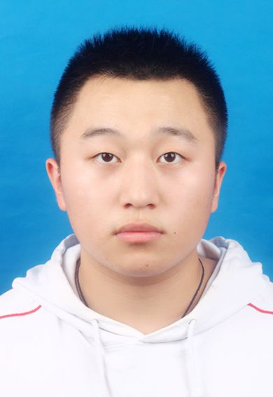

  <table border="0">
  <tr>
    <td width="75%">
      <h1>付凯磊</h1>
      
<b>本科生</b>

      
<b>浙江万里学院</b>

      
<b>邮箱：2117139711@qq.com</b>

      
<b>地址：河北邯郸魏县</b>

    </td>
    <td width="25%">
             
    </td>
  </tr>
</table>

   姓名：付凯磊
   
   学习方向：通信工程
   
   爱好：打篮球，听音乐，下厨
   
   个人评价：幽默风趣开朗
    
    荣誉奖励
    
    -2015年上海市跆拳道邀请赛42KG冠军
